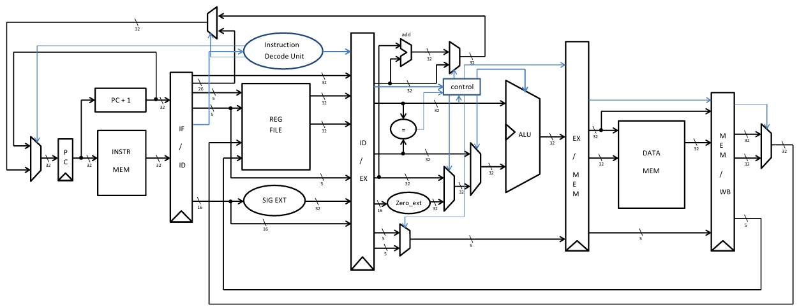
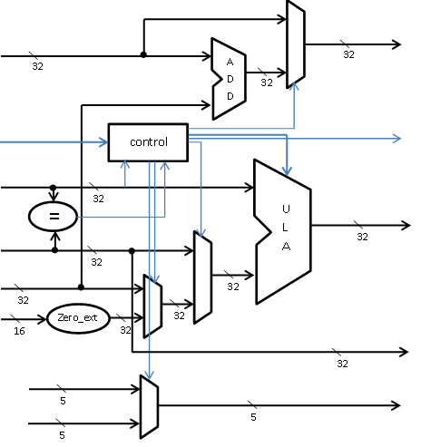
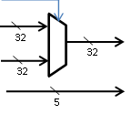

# Single-Cycle MIPS Processor in Verilog
MIPS Processor in Verilog

> [!IMPORTANT]
> Research purpose only, this is a my first attempt to write a MIPS processor back in 2011. It was not finished at the time, I plan to finish. 

This repository contains a Verilog implementation of a single-cycle MIPS (Microprocessor without Interlocked Pipeline Stages) processor. The project is designed to simulate and understand the fundamental components of a MIPS architecture, including the datapath, control unit, and instruction execution.

## Table of Contents
- [Overview](#overview)
- [Features](#features)
- [Architecture Planned](#architecture-planned)
- [Documentation](#documentation)
- [Prerequisites](#prerequisites)
- [Getting Started](#getting-started)
  - [Cloning the Repository](#cloning-the-repository)
  - [Simulating the Design](#simulating-the-design)
- [Project Structure](#project-structure)
- [Contributing](#contributing)
- [License](#license)

## Overview

The MIPS processor is a classic RISC (Reduced Instruction Set Computer) architecture widely used in academic settings to teach computer organization and design. This project implements a **single-cycle** version of the MIPS architecture in Verilog, focusing on the core components such as:

- **Instruction Fetch (IF)**
- **Instruction Decode (ID)**
- **Execution (EX)**
- **Memory Access (MEM)**
- **Write Back (WB)**

The design is simulated using **Icarus Verilog (iverilog)** and waveforms are visualized using **GTKWave**.

## Features

- **Single-cycle implementation**: Executes one instruction per clock cycle.
- **Basic Instruction Set**: Supports a subset of MIPS instructions, including:
  - `ADD`, `SUB`, `AND`, `OR`, `SLT`
  - `LW` (Load Word), `SW` (Store Word)
  - `BEQ` (Branch if Equal), `J` (Jump)
- **Simulation Ready**: Includes testbenches for functional verification.

## Architecture planned



## Documentation

> [!CAUTION]
> For now, this documentation it's only in Portuguese.

Para este estudo será utilizado apenas 31 instruções da tabela principal de decode do instruction set da especificação do MIPS, que são descritas abaixo:


|  Instruction Set |
| ---------------- |


|        |      |   I - Type     |          |           |
| -------|----------|-----------|-----------|---------- |
| ADDI	 |  001 000 | rs	    |   rt	    | Immediate |
| ADDIU  |	001 001 | rs	    |   rt	    | Immediate |
| ANDI   |	001 100	| rs	    |   rt	    | Immediate |
| ORI    |	001 101	| rs	    |   rt	    | Immediate |
| XORI   |	001 110	| rs	    |   rt	    | Immediate |
| LUI    |	001 111	| 00 000	|   rt	    | Immediate |
| SLTI   |	001 010	| rs	    |   rt	    | Immediate |
| SLTIU  |	001 011	| rs	    |   rt	    | Immediate |
| LW	 |  100 011	| rs (base)	|   rt	    | Immediate |
| SW	 |  101 011	| rs (base)	|   rt	    | Immediate |
| BGTZ   |	000 111	| rs	    | 00000(0)	| Immediate |
| BLEZ   |	000 110	| rs	    | 00000 (0)	| Immediate |
| BEQ    |	000 100	| rs	    |   rt	    | Immediate |
| BNE    |	000 101	| rs	    |   rt	    | Immediate |
| BEQL   |	010 100	| rs	    |   rt	    | offset    |
| BGTZL  |	010 111	| rs	    | 00000 (0)	| offset    |
| BLEZL  |	010 110	| rs	    | 00000 (0)	| offset    |
| BNEL   |	010 101	| rs	    |   rt	    | offset    |
| LB	 |  100 000	| (base)    |	rt	    | offset    |
| LBU    |	100 100	| (base)    |	rt	    | offset    |
| LH     |	100 001	| (base)    |	rt	    | offset    |
| LHU    |	100 101	| (base)    |	rt	    | offset    |
| LL     |	110 000	| (base)    |	rt	    | offset    |
| LWL    |	100 010	| (base)    |	rt	    | offset    |
| LWR    |	100 110	| (base)    |	rt	    | offset    |
| SB     |	101 000	| (base)    |	rt	    | offset    |
| SC     |	111 000	| (base)    |	rt	    | offset    |
| SH	 |  101 001	| (base)    |	rt	    | offset    |
| SWL    | 	101 010	| (base)    |	rt	    | offset    |
| SWR    |	101 110	| (base)    |	rt	    | offset    |

|       |  J-Type |       |
| ----- | ------- | ----- |
|  J 	| 000 010 |	Index |
| JAL	| 000 011 | Index |

A codificação do OPCODE do MIPS é descrito no apêndice A (em anexo), assim como as descrições de cada instrução está descrito no apêndice B (em anexo).

Para a primeira versão será implementado o data path sem pipeline e será descriminado cada passo para execução de cada instrução.

De acordo com a arquitetura do MIPS, será necessário um PC (Program Counter), para apontar o fluxo do programa que estará sendo executado, que servirá de “endereço” para a memória. A mesma deverá ao ser selecionado o endereço, entregar no barramento de dados da mesma a instrução que será executada pelo processador, enquanto o PC é incrementado paro o próximo endereço, este passo geralmente é chamado de Instruction Fech. O diagrama em blocos abaixo representa o Instruction fech do MIPS:


Lembrando que todas as linhas são barramentos de 32-bits.

Após ser capturada a instrução, o próximo passo é decodificá-la, para isso será necessário outros componentes, como register file para capturar os registros que serão utilizados na instrução, um signal extension para instruções que precisem de um e uma unidade para decodificar a instrução, esse passo geralmente é chamado de Instruction Decoder. O Diagrama abaixo representa a fase de Instruction decoder do MIPS:


As instruções do tipo J-Type, podem ser resolvidas nesse estágio, já que são alterações diretas no registrador PC, controladas pelo instruction decoder unit, que também controla outros mux’s que serão apresentados mais a frente.

O próximo estágio é chamado estágio de execução que de fato onde será processada a instrução, nesse estágio que se encontra a ULA (Unidade lógica e aritmética), precisa-se selecionar controles para o que será alimentado na ULA, necessitando de controles paralelos, neste estágio se encontra algumas operações fora da ULA para execução de instruções do tipo branch, como comparadores e somadores mesmos junto com seus controles. Que por sua vez são controlados pelos sinais vindo do estágio anterior da unidade de decodificação. Esse estágio tem seu diagrama mostrado abaixo:




Os tamanhos dos barramentos de controle não estão descriminados, pois podem ser mudados ao decorrer do projeto.

O próximo estágio é para caso necessite escrita em memória de dados, usada nas instruções LW e SW, caso contrário o resultado do estágio anterior é diretamente repassado para o próximo estágio, este estágio também é conhecido como estágio de memória e tem seu diagrama mostrado abaixo:


Após esses passos, resta apenas escrever as respostas novamente no register file, para isso é acrescentado um estágio chamado Write Back que possui seu diagrama de blocos como o apresentado abaixo:




Implementação

Primeiramente será implementado o processador sem pipeline, executando a instrução em um único ciclo, posteriormente será implementado o processador com pipeline considerando cada estágio do pipeline com um único ciclo de clock.

Para realização da implementação da memória, será utilizado um modelo para a mesma com as system tasks $readmem e $writemem. Futuramente será projetado um memory controller.

A unidade lógica e aritmética (ULA) precisará para esta primeira versão possuir as seguintes operações: ADD, SUB, AND, OR, XOR, NOR, Left Shift e Right Shift e será suficiente apenas 3 bits seleção de todas as operações.

O register file precisará de um controle especial para alguns de seus registradores, devido à particularidade de alguns registros. 

A unidade de controle para as duas implementações será uma lógica combinacional, devido a todas as instruções serem executadas em um único ciclo mesmo que o desempenho seja prejudicado e não existirá lógica de controle de hazards.

- Instrução J: Decodifica a instrução, 26 bits voltam para o (32bit, shift left by 2, 3 ultimos bits são da próxima instrução )PC.

- Instrução JAL: Mesmo que antes, porém também escreve no registrador 31 com o próximo endereço (PC+1 (ou +4 ou +8 dependendo da implementação)

- Instrução BEQ: if rs == rt então PC + offset << 2 (18 bits)

- Instrução BEQL: if rs == rt então PC + offset << 2 (18 bits) depois da próxima instrução (não implementado no MIPS 1, está obsoleta, RIE)

- Instrução BGTZ: if rs > 0 então PC+ offset << 2 (18 bits) (signed)

- Instrução BGTZL if rs > 0 então PC+ offset << 2 (18 bits) (signed) depois da próxima instrução (não implementado no MIPS 1, está obsoleta, RIE)

- Instrução BLEZ if rs <= 0 então PC+ offset << 2 (18 bits) (signed)

- Instrução BLEZL if rs <= 0 então PC+ offset << 2 (18 bits) (signed) depois da próxima instrução (não implementado no MIPS 1, está obsoleta, RIE)
- Instrução BNE if rs != rt então PC+ offset << 2 (18 bits)

- Instrução BNEL if rs != rt então PC+ offset << 2 (18 bits) (signed) depois da próxima instrução (não implementado no MIPS 1, está obsoleta, RIE)

- Instrução ADDI rt <= rs + immediate (signed) if overflow não escreve em rt e integer overflow (temp32 != temp31)

- Instrução ADDIU rt <= rs + immediate  (signed)doesn’t overflow

- Instrução ANDI rt <= rs AND zeroext(immediate)

- Instrução LB  rt <= datamemory[ rs+ immediate  (signed)] (8-bit ou 1byte)

- Instrução LBU rt <= datamemory[ rs+ zeroext(immediate)] (8-bit ou 1byte)

- Instrução LH rt <= datamemory[ rs+ immediate  (signed)] (16-bit ou halfword)

- Instrução LHU rt <= datamemory[ rs+ zeroext(immediate)] (16-bit ou halfword)

- Instrução LL rt <= datamemory[ rs+ immediate  (signed)] (32-bit ou word) começa RMW sequencia esperando um SC (LLbit <= 1, sequencia unica) caso contrário sai da sequencia

- Instrução LUI rt <= immediate  << 16 (mais significativo e o resto zero)

- Instrução LW rt <= datamemory[ rs+ immediate  (signed)] (32-bit ou word)

- Instrução LWL

- Instrução LWR

- Instrução SB

- Instrução SW

- Instrução SC

- Instrução SH

- Instruçao SLTI

- Instrução SLTIU

- Instrução SWL

- Instrução SWR

- Instrução ORI

- Instrução XORI

## Prerequisites

To simulate and test the Verilog code, you need the following tools installed:

- **Icarus Verilog (iverilog)**: For compiling and simulating Verilog code.
- **GTKWave**: For viewing waveform outputs.
- **Make (optional)**: For automating the build and simulation process.

### Installation

#### On Ubuntu/Debian
```bash
sudo apt-get install iverilog gtkwave
```

#### On macOS (using Homebrew)
```bash
brew install icarus-verilog gtkwave
```

#### On Windows

- Download and install [Icarus Verilog](http://iverilog.icarus.com/).
- Download and install [GTKWave](http://gtkwave.sourceforge.net/).

## Getting Started

### Cloning the Repository
```bash
git clone https://github.com/your-username/mips-processor-verilog.git
cd mips-processor-verilog
```

### Simulating the Design
1. Compile the Verilog code:

```bash
iverilog -o mips_simulation -s testbench mips_processor.v testbench.v
```

2. Run the simulation:

```bash
vvp mips_simulation
```

3. View the waveform:

```bash
gtkwave waveform.vcd
```

4. Automate with Make (optional):
If a Makefile is provided, you can simply run:

```bash
make simulate
make view
```

## Project Structure

```
mips-processor-verilog/
├── src/                  # Verilog source files
│   ├── mips_processor.v  # Main MIPS processor module
│   ├── alu.v            # Arithmetic Logic Unit
│   ├── control_unit.v    # Control Unit
│   ├── reg_file.v       # Register File
│   └── ...              # Other modules
├── testbench/            # Testbench files
│   └── testbench.v       # Main testbench
├── waveform.vcd          # Generated waveform file
├── Makefile              # Makefile for automation
└── README.md             # This file
```

##  Contributing
Contributions are welcome! If you'd like to contribute, please follow these steps:

1. Fork the repository.
2. Create a new branch for your feature or bugfix.
3. Commit your changes.
4. Submit a pull request.

Please ensure your code follows the existing style and includes appropriate testbenches.

## License
This project is licensed under the GPL-3.0 License. See the [LICENSE](LICENSE) file for details.
